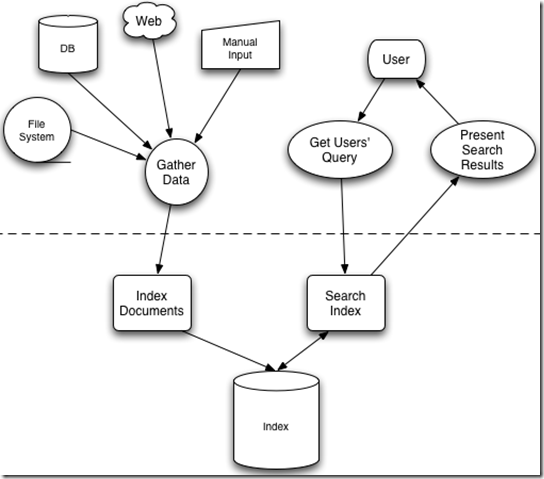

#Lucene学习笔记一，全文检索的基本原理

> **Lucune是一个高效的，基于Java的全文检索库**

###1. 全文检索总论

数据类型：

- **结构化数据**：固定格式、有限长度。e.x, 数据库、元数据。
- **非结构化数据**：**全文数据。**无固定格式、不定长。e.x, word、邮件。
- **半结构化数据**：XML、HTML

搜索方式：

- *对结构化数据的搜索：* SQL语句，windows搜索文件名
- *对非结构化数据的搜索：* *全文搜索*。windows搜索文件内容，Google搜索

**索引**，从非结构化数据中，提取出信息，结构化存储，以进行全文搜索。

###2. 倒排索引

保存从字符串到文件的映射。  
左侧保存一系列字符串，称为**词典**。   
每个字符串指向文档链表，称为**倒排表**。  
一次索引，多次使用。  

###3. 创建索引

**术语集:**

* 分词组件 *(Tokenizer)*,
* 停词(*Stop word*)
* 词元*(Token)*
* 语言处理组件*(Linguistic Processor)*
* 缩减为词根*(stemming)*
* 转变为词根*(lemmatization)*
* 词*(term)*
* 索引组件*(Indexer)*
* 文档频次*(Document Frequency)*：包含此词的文档数
* 词频率*(Term Frequency)*：词总共出现的次数

**创建索引的步骤：（英文文档）**

1. 文档传给分词组件，分成一个个单独的单词
2. 去除标点符号,去除一些停词,得到词元
3. 将得到的词元传给语言处理组件。对于英语的常见操作：转换小写、缩减为词根、转变为词根。
4. 将得到的词传给索引组件，主要做：创建字典、按字母排序、合并同词成为文档倒排链表。

*Stemming, Lemmatization区别：*

* Stemming: 缩减。cars->car  固定方式
* Lemmatization: 转变。drove->drive	查词典方式

*PS：两者可能有交集*

###4. 对索引进行搜索

##### Step1. 用户输入查询语句。

有一定的语法，例如SQL。

##### Step2. 对查询语句进行分析

***词法分析***：识别单词、关键字  
关键字如and, or, not.   
***语法分析***：根据查询语法形成语法树  
***语言处理***：缩减、转变单词

##### Step3. 搜索索引，找到符合语法树的文档

找出包含所查词汇的文档链表  
根据语法树，对结果链表进行适当的合并、求差等操作 

##### Step4. 根据相关性排序★

每个文档中，不同Term重要性不同。  
对于不同文档，同一Term重要性也不同。  
*方法：*  
①首先判断哪些Term对文档之间的关系最重要  
②再判断这些词的关系  

搜索及查询索引流程图：  

---
### 计算权重*Term Weight* 

* Term Frequency. 越大越重要（该词是重点）
* Document Frequency. 越大越不重要（该词太普通）

求权值函数 \\[w\_{t,d}=tf\_{t,d} \times log\frac{n}{df_t}\\]

是一个简单的实现。
其中，

\\[\begin{aligned} w\_{t,d} &= \text{the weight of the term $$$t$$$ in document $$$d$$$} \\\
tf\_{t,d} &= \text{frequency of term $$$t$$$ in document $$$d$$$}\\\
n &= \text{total number of documents}\\\
df_t &= \text{the number of documents that contain term $$$t$$$} \end{aligned}\\]

### 给Document打分，VSM算法
**(VSM, Vector Space Model，向量空间模型)**

我们把文档看做一系列词，由于每个词有一个权重*Term Weight*，一篇文档就有一个权重向量。

\\[Document\quad Vector = <{w_1,w_2, ..., w_n}>\\]

同样地，查询语句也看做简单的文档，以向量表示。  

\\[Query\quad Vector = <{w_1,w_2,...,w_n}>\\]

两者的夹角即可表示其这篇文档的相关度，可由余弦公式得出。

\\[ score(q,d)=\frac{\mathbf{V}\_1 \cdot \mathbf{V}\_2}{\lvert\mathbf{V}\_1\rvert\lvert\mathbf{V}\_2\rvert}\\]

2015年8月5日  
©copyright 慕瑜
