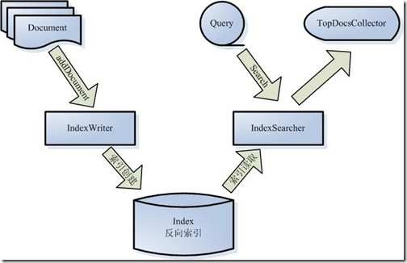

#笔记二：Lucene的总体架构

***Lucene的几个特点：***

<link rel="stylesheet" href="//cdnjs.cloudflare.com/ajax/libs/highlight.js/8.7/styles/default.min.css">
<script src="//cdnjs.cloudflare.com/ajax/libs/highlight.js/8.7/highlight.min.js"></script>

* 一个高效的、可扩展的全文检索库
* 用Java实现
* 仅支持纯文本文件的索引和搜索
* 不负责由其他格式抽取纯文本文件，或网络抓取文件

这是一张Lucene的组件图，展示了其不同组件：



各组件功能如下:

* IndexWriter通过函数addDocument将文件添加到索引
* IndexSearcher通过函数search搜索Lucene Index，计算term weight & score, 返回结果
* TopDocsCollector表示返回的文档结果
* 各个组件均有其相应的API，以供调用

*创建索引过程*  

1. 创建IndexWriter用来写索引文件，参数有索引文件位置INDEX_DIR, 词法分析器Analyzer.
2. 创建Document表示要索引的文档.
3. 将不同的Field加入到文档中，如路径、文本.
4. IndexWriter调用addDocument函数写入索引.

*查询索引过程*

1. 创建IndexReader，将磁盘索引信息读入到内存.
2. 创建IndexSearcher，准备检索索引.
3. 创建Analyer, QueryParser用来对查询语句进行词法分析、语言处理、语法分析.
4. QueryParser调用parser进行语法分析，生成查询语法树，返回一个Query.
5. IndexSearcher调用search对查询语法树Query进行检索，返回结果.


*常用的Java包*

* *org.apache.lucene.analysis*	词法分析，语言处理相关，Analyzer, TokenStream.
* *org.apache.lucene.document*	文档相关，Field.
* *org.apache.lucene.index*		索引相关，IndexWriter, IndexReader.
* *org.apache.lucene.search*	搜索相关，IndexSearcher.
* *org.apache.lucene.store*		索引存储相关，IndexInput, IndexOutput, RAMDictionary.


*使用说明*

> To use Lucene, an application should:  
> 1. Create Documents by adding Fields;  
> 2. Create an IndexWriter and add documents to it with addDocument();  
> 3. Call QueryParser.parse() to build a query from a string;    
> 4. Create an IndexSearcher and pass the query to its search() method.  

**样例代码**([Lucene 5.2.0 官方文档](http://lucene.apache.org/core/5_2_0/core/index.html))：


```

	Analyzer analyzer = new StandardAnalyzer();

    // Store the index in memory:
    Directory directory = new RAMDirectory();
    // To store an index on disk, use this instead:
    //Directory directory = FSDirectory.open("/tmp/testindex");
    IndexWriterConfig config = new IndexWriterConfig(analyzer);
    IndexWriter iwriter = new IndexWriter(directory, config);
    Document doc = new Document();
    String text = "This is the text to be indexed.";
    doc.add(new Field("fieldname", text, TextField.TYPE_STORED));
    iwriter.addDocument(doc);
    iwriter.close();
    
    // Now search the index:
    DirectoryReader ireader = DirectoryReader.open(directory);
    IndexSearcher isearcher = new IndexSearcher(ireader);
    // Parse a simple query that searches for "text":
    QueryParser parser = new QueryParser("fieldname", analyzer);
    Query query = parser.parse("text");
    ScoreDoc[] hits = isearcher.search(query, null, 1000).scoreDocs;
    assertEquals(1, hits.length);
    // Iterate through the results:
    for (int i = 0; i < hits.length; i++) {
      Document hitDoc = isearcher.doc(hits[i].doc);
      assertEquals("This is the text to be indexed.", hitDoc.get("fieldname"));
    }
    ireader.close();
    directory.close();
    
```
   
   
 [IndexFiles.java](http://lucene.apache.org/core/5_2_0/demo/src-html/org/apache/lucene/demo/IndexFiles.html) creates an index for all the files contained in a directory.
 
 [SearchFiles.java](http://lucene.apache.org/core/5_2_0/demo/src-html/org/apache/lucene/demo/SearchFiles.html) prompts for queries and searches an index.


<br />
2015年8月6日  
©copyright 慕瑜