# 笔记五：词典的设计

> 本文学习自[觉先的博客](www.cnblogs.com/forture1978/p/3945755.html)

词典中，所保存的信息主要是三部分：

- Term字符串
- Term统计信息，如文档频率
- 倒排表的位置信息

其中，Term字符串是按字典排好序的，其保存是一个值得研究的话题。

## 顺序列表式

- 查找方便，可二分查找
- 空间浪费大
- 无法得知最长的字符串长度

## 指针列表式

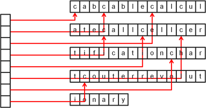

- 实际数据紧密排列
- 指针可二分查找

## 前端编码式

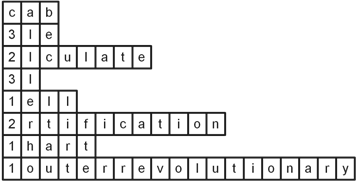

- 按字典顺序排列的词汇，通常具有相同的前缀
- 前缀编码(front coding)方式，更加节约了空间
- 缺陷：二分法不再可行，解压缩变得麻烦

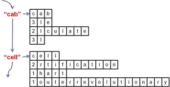

- 一种改进的方式
- 把整个Term分块，每块有一个排头兵
- 每次解压缩只需要解压缩一个块
- 排头兵数量较少，可以使用指针列表方式，进行二分查找，甚至可以完全加载到内存中

## 最小完美哈希

- 在定位排头兵位置时，哈希表是一种很快的方法
- 最小完美哈希是对静态哈希表的充分利用，**节省空间**，同时**没有冲突**
- 最小完美哈希有很多算法
- 以下为一种CHM算法，是一种无向图的方法。论文见[*An optimal algorithm for generating minimal perfect hash functions*](https://scholar.google.com.hk/scholar?hl=zh-CN&q=An+optimal+algorithm+for+generating+minimal+perfect+hash+functions&btnG=&lr=)。

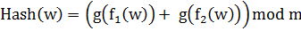

这是基本的哈希函数的样子。

其中，w为需要哈希的字符串，m是字符串的总数。f1、f2是两个随机函数，将字符串映射成为两个数字，范围[0, n-1]。其中，n是一个比m大的数，目的是减少出现环的概率，一般n>2m。

g函数则是一个精心设计的函数，达到每个初始字符串仅被映射到一个桶的效果。
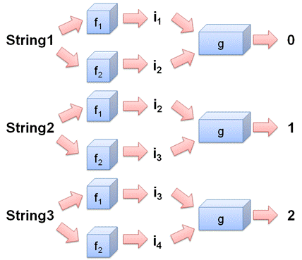

对于函数f1, f2，采用这样的设计:对于每个字符w[i]，生成一个取值[0, n-1]的随机数，从而形成一个表格T1，形成表格T2。f函数即可如下：

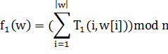  
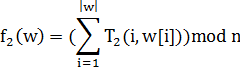

例如：以英语十二个月为字符串，产生随机数表：（可以重复）

Jan, Feb, Mar, Apr, May, Jun, Jul, Aug, Sep, Oct, Nov, Dec

后两个字母已经可以唯一确定字符串，只取后两个字母

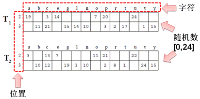

由这张随机数表，可以确定f1函数

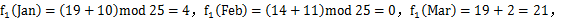  
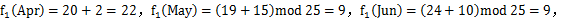  
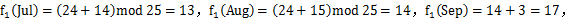  
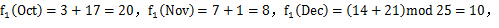  

f2函数同理

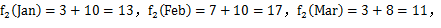  
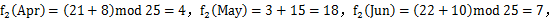  
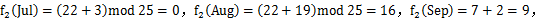  
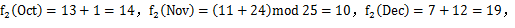

产生相应的图，其中，连接两点的线上的数字为希望放入的桶（目标桶）

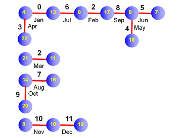

根据该图产生g函数，保证相邻节点的函数值的和，恰好等于连线上的数字。（这也就为何不能出现环的原因）

每个连通分支中可以随机选一个初值，剩余的根据上述方法计算

最后可以得到这样的g函数映射表：

 0| 4| 7| 8| 9|10|11|13|14|16|17|18|19|20|21|22
--|--|--|--|--|--|--|--|--|--|--|--|--|--|--|--
 0|-6|-1| 0| 6|10| 0| 6| 0| 7| 2|-2| 1| 9| 2| 9
 
 
可以看出该表与上图的对应关系

至此，函数已经生成。可举一例子，可以看出，能够快速定位字符串所在的目标桶。

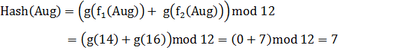

## 双数组Trie树

- Trie树针对字符串的查询效率也非常高

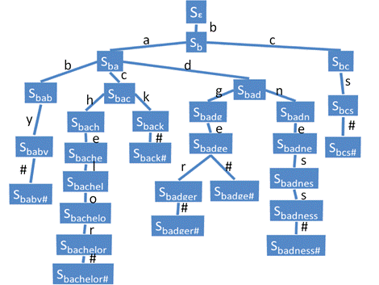 
 
- 可加入后缀优化，树被优化为：

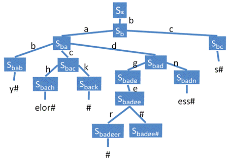

维护这样一个Trie树，可以通过双数组的方式：

- Base数组，维护了其子节点的相对偏移量，当它为负数时，子节点在Tail数组中。
- Check数组，维护了其父节点的位置。
- Tail数组，直接保存字符串后缀的。

具体方法如下：

- Base[1] = 1， 因而根节点的下属节点Sb的位置为Base[1] + b = 1 + 2 = 3.
- Check[1] = 20. 比较特殊， 表示Base和Check数组的总大小.
- Check[3] = 1. 表示Sb的父节点存储在位置1.
- Base[3] = 6. 因而Sb的下属节点Sba位置为Base[3] + a = 6 + 1 = 7, Sbc位置为Base[3] + c = 6 + 3 = 9.
- Base[9] = -10, 在Tail[10]中顺序取，取出s#, 一起构成了bcs#.
- Base[i] = Check[i]  = 0 时，该位置暂时没有数据存储。

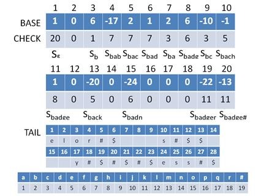

具体的产生方法不冗述。大致为不停加入新元素，遇到冲突时进行调整。

- 被称为有限状态机规则
- 整个结构需要保存在内存中，若在硬盘中，对于冲突的移动会非常影响性能。

## M路查找树

- 当词典非常大，内存难以放下时，需要保存在硬盘上。
- 此时，M路查找树是一个不错的选择。
- 最典型的即为B+树，是一种多路平衡树。所有的外部节点位于同一层，且所有节点的容纳率至少为二分之一。

 
2015年8月10日

©copyright 慕瑜