# 笔记六：倒排表的格式设计

> 本文学习自[觉先的博客](http://www.cnblogs.com/forfuture1978/p/3944583.html)

## 定长编码

- 文档ID列表可以采用定长编码的形式。
- 同样，空间被浪费，同时，难以确定最长位数。

## 差值编码

- D-gap
- 如果Term在文档中的分布比较均匀，可以存储差值。
- 每个数值比较小，可以节约空间。
- 但是，常常某个Term在某一段出现频率非常高，聚集性地出现，然后又长时间不出现。

## 一元编码

- Unary Coding
- 变长编码会有很多问题，如数值长度不同没有结束符、无法判断是前缀还是数值、多位少位错位均产生编码混乱。
- 一元编码，对于正整数x，用x-1个1和末尾1个0表示，如5即为11110.
- 虽然不实用，不过是很多变长编码的基础。

## Elias Gamma编码

- 是一元编码与二进制编码的结合
- 对于正整数x，首先对$$$1+\lfloor log_2x\rfloor$$$进行一元编码，然后用$$$\lfloor log_2x\rfloor$$$个bit对$$$x-2^{log_2x}$$$进行二进制编码。
- 如对于10，编码结果为1110010.前四位得到4, 所以后3位是二进制编码部分，为2。$$$2^{4-1}+2=10$$$
- 数字大的时候，会暴露出其一元编码部分的弱势

## Elias Delta编码

- 是Elias Delta编码的改进
- 对于正整数x，首先对$$$1+\lfloor log_2x\rfloor$$$进行Gamma编码，然后用$$$\lfloor log_2x\rfloor$$$个bit对$$$x-2^{log_2x}$$$进行二进制编码。
- Delta编码是Gamma编码和二进制编码的结合，也是一种变长编码。
- 比较适合大数值的情形

## Haffman编码

- 根据数值频率，频率高的编码长度短一些，频率低的编码长度长一些。
- 可以保证没有一个编码是另一个的前缀
- 规范Haffman编码，规范性解决一些诸如同值处理的问题。同一层次中，无论节点排序如何，均按照数值或字符的排序来决定编码。

得到的规范编码如图：  
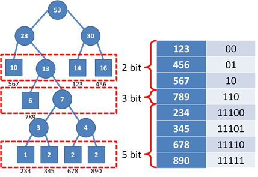

因而，只需要存储下列数据结构：

- FirstCode: n位的编码的起始编码
- Number: n位编码的个数
- Position：n位编码的位置，-1表示不存在
- Value：保存具体的编码值

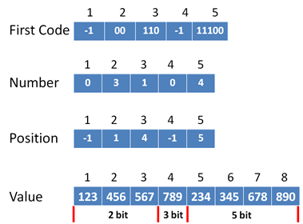

**特点：**

- 压缩效果非常好
- 但是是需要在压缩前，进行全局的观测。
- 在实际搜索引擎中，文档是不断添加的，很难事先全局统计。

## Golomb编码

- 简单地假设文档ID的概率分布，以省略统计过程
- 可假设Term在文档集集合中独立随机出现
- 在文档ID相对均匀时，Golomb编码表现较好
- 一元编码保证了数值增加1，编码多一位；Golomb编码则是数值增加b，编码多一位，剩余的余数部分可以用Haffman编码
- x表示某Term的出现间隔，b则是编码参数
- 文档间隔为$$$x$$$的出现概率$$$p(x)=(1-p)^{x-1}p$$$，文档间隔为$$$x+b$$$的出现概率为$$$p(x+b)=(1-p)^b(1-p)^{x-1}p$$$, 当$$$(1-p)^b=\frac{1}{2}$$$时，编码长度应该增加一位。所以$$$b=-\frac{ln2}{ln(1-p)}$$$
- 对于数值的编码分两部分，第一部分计算$$$q=\lfloor \frac{x-1}{b}\rfloor$$$,对$$$q+1$$$使用一元编码，第二部分是余数，$$$r=x-1-qb$$$,其一定在$$$[0, b-1]$$$之间，使用Haffman编码。
- 可以使用极限理论得到计算b的更好方式，$$$b=0.69*\frac{N \times n}{f}$$$

示例：

x=9，b=6时，x的编码为10100. 第一部分q=1, q+1被一元编码为10, 第二部分余数r=2，Haffman编码为100.
x=15, b=6时 x的编码为110100.第一部分q=2, q+1被一元编码为110, 第二部分余数r=2, Haffman编码为100. 验证了x增长b，编码长度增加一位的要求。

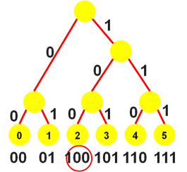

## 插值编码

- Binary Interpolative Coding
- Golomb编码的假设是Term在文档中的出现独立随机，事实上可能不一定
- 插值编码可以灵活应对不均等分布的情形
- 每次插值编码时，有三个参数，length, low, high
- 分治算法

以该图为样例，数据集中分布在8-13区域。

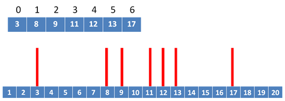
 

Step1. 首先, <length = 7, low = 1, high = 20>，计算出mid = 3，先找到中间数11，它的左右都需要各留三个位置，所以其取值范围为4-17, 有14种取值，需要4位bit存储，11 - 4 = 7, 被编码为0111. 

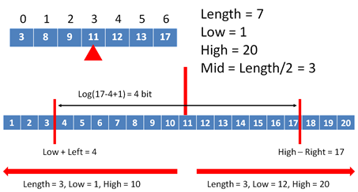

 

Step2. 此时被分成了左右两个区。先看左区, <length = 3, low = 1, high = 10>, mid = 1. 需要对8进行编码，左右各留一个空位，取值范围为2-9，有8种取值，需要3位bit存储， 8 - 2 = 6, 被编码为110.

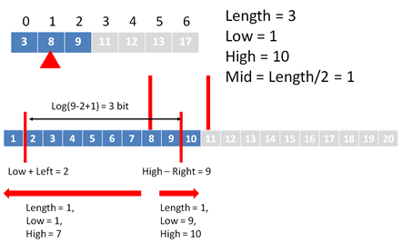
 
同理，以此类推，  
<length = 1, low = 1, high = 7>, 3被编码成010.
<length = 1, low = 9, high = 10>, 9被编码成0.
<length = 3, low = 12, high = 20>, 13被编码成000.
<length = 1, low = 12, high = 12>, 12位置已固定，无需编码.
<length = 1, low = 14, high = 20>, 17被编码成011.

综上，最终的编码为 0111 110 010 0 000 011. 一共17位。

相同的数据用Golomb编码插值<3,5,1,2,1,1,4>, b = 2, 需要18位。

解码过程依据编码过程一步步解即可

## Variable Byte编码

- 变长字节编码
- 上述所有编码都是基于一位的，称为基于位的编码(bitwise)
- 然而计算机中数据的存储计算以word， Byte为单位。bitwise的方式节约空间，但是编码解码过程中大量的位运算会影响速度。对于信息检索系统，查询速度非常重要。
- Variable Byte在空间上有些浪费，但是查询速度上表现很好。
- 变长字节编码中，每个Byte首位是标记位，1表示未完待续，0表示是该编码最后一个byte.
- 剩余的7个bit用来实际编码，二进制编码。

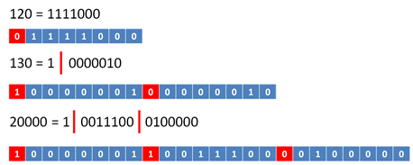

## PForDelta编码

#### 批量标记
- 变长字节编码，虽然基于byte编码，但是由于标记位的存在，每个byte仍然需要进行位操作。
- 可以将多个byte作为一组，集中flag，作为一个Header记录。
- 其中，Header中，就是一元编码。
 
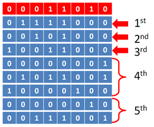

因而，Header内部的编码也有讲究。

#### Length Encoding
- 在Header中，采用二进制编码，每两位组成一个二进制编码，因而两位可以可以表示出最多4个byte(32bit)，可以表示大部分整数。
- 这种方式称为**长度编码(Length Encoding)**

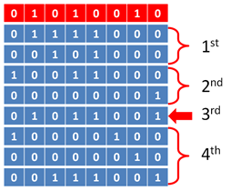

#### Binary Length Encoding
- 如果数据更大，32位不够，还可以不采用二进制编码，而是一组flag，标记长度是否能被压缩到n个Byte，0为能，1为不能，用原长表示。
- 它的思路是，可以压缩的打包处理，太大不能压缩的单独处理。这种思想是PForDelta编码的基础。
- 这种方式称为**Binary Length Encoding**

- 样例图中，n=2,即如果能被压缩为2个byte就压缩，否则用全32位表示。
- 可以看到，3rd数字不能被压缩，虽然可以被3个Byte表示但是使用了完整的32位。

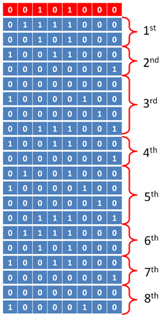

#### 异常链
- Binary Length Encoding将能压缩的和不能压缩的混合存储，不利于批量压缩和解压缩。
- PForDelta将两部分分开存储。
- 可压缩部分为**Code Section**, 不能压缩的部分为**Exception Section**
- 需要保持原来数值列表的顺序
- 如果采用方案(a), 用指针指向异常区域中数值位置，这个指针最多只能占用b个bit，往往不够一个指针长度。
- 可以采用方案(b), 保存下一个异常位置的偏移量。解压缩时可以产生一个异常链。
- 如果不幸遇到了(c)所示的情况，偏移量依然过大，可以采用手动插入一个异常的方式。当然，对应地，异常区域中也需要插入一个不存在的数值。这样缺点是增加了无用数值，降低了压缩率，因而，实际中，b一般不会小于4.

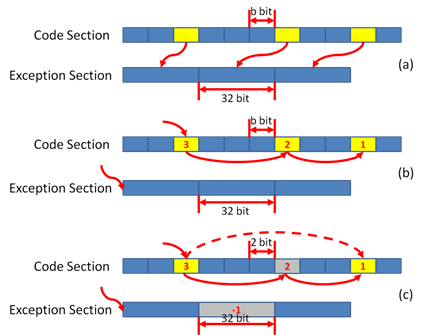

#### PForDelta

- **Patched Frame of reference-Delta**
- 压缩后的n个bit，称为一个Frame, Patched就是将这些Frame打包，Delta表示打包的是差值。
- 将数值分块(block)存储，一块可以包含几百万数值，可达几个MB。一般在内存中保存几个MB的Buffer，读取数据按照一定格式填满，写入磁盘，然后处理下一块。
- 块有四个部分。是紧挨着的。（编码区和异常区之间可能会存在空隙）
- 第一部分**Header**，保存了这个块的大小，保存了压缩后的数值采用的bit数
- 第二部分是**Entry point**数组，有N项，每个Entry管理128个数值，每项32位，前7位表示这个Entry管理的128个数值中第一个异常位置，后25位保存了这128个数值的异常区域的起始位置。这个数组的存在可以再一个块中随机访问而不用顺序读取。
- 第三部分是**Code Section**，实际的编码区，存放了一系列被压缩为b个bit的数值，每128个被一个Entry管理，总计128 * N个数值。异常位置以异常链的形式串起。
- 第四部分是**Exception Section**, 存放不能压缩，以32个bit存储原始数值的部分。这一部分数值从后往前存放。
- 编码区从前往后增长，异常区从后往前增长。当中间空间不足时，留下一段空隙。编码区域一定是字对齐的。写入磁盘时，编码区和异常区紧密相邻。
- PForDelta的字对齐和批量处理，使得我们不再需要逐个bit处理数据。
- 硬盘上的海量索引文件，由多个PForDelta块构成。

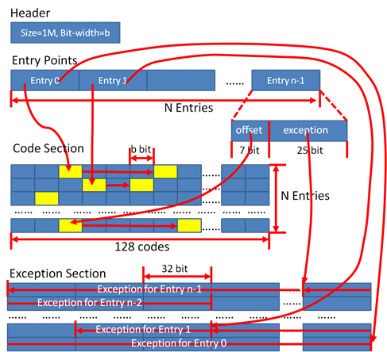

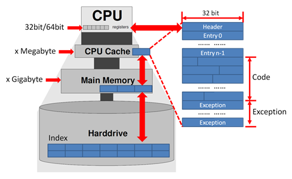

 
 

2015年8月10日

©copyright 慕瑜